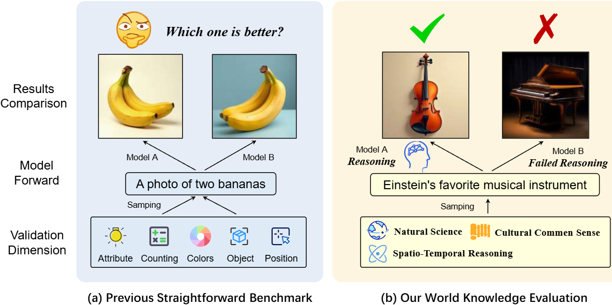

# WISE

This repository is the official implementation of [WISE](https://arxiv.org/abs/2503.07265).

**Current default: WISE_Verified.** If you need the original GPT-4o based WISE release, see [WISE_legacy](WISE_legacy/README.md).



## 💡 News
- 2026/04/25: Add DeepGen 1.0 results.
- 2026/04/21: Add Uniwolrd-V1 results.
- 2026/04/19: We release **WISE_Verified**, a maintenance update for easier and lower-cost evaluation. It uses a vLLM-served **Qwen3.5-35B-A3B** judge, refreshes about 200 prompts, changes WiScore into a binary 0/1 score focused on world-knowledge consistency and realism, and updates the leaderboard with 21 models, including NanoBanana-Pro, GPT-Image-1.5, QwenImage, FLUX.2, BAGEL, and HunyuanImage.
- 2025/06/03: We updated the original code to provide clearer, simpler, and easier evaluation.
- 2025/05/24: We collected feedback and updated the original code. If you have any questions or comments, feel free to email us at [niuyuwei04@gmail.com](mailto:niuyuwei04@gmail.com).
- 2025/03/11: We released our paper at [https://arxiv.org/abs/2503.07265](https://arxiv.org/abs/2503.07265).
- 2025/03/10: We released the original code and data.

## 🎩 Introduction

Text-to-Image (T2I) models can generate high-quality artistic creations and visual content. However, existing research and evaluation standards often focus on image realism and shallow text-image alignment, while lacking a comprehensive assessment of complex semantic understanding and world knowledge integration in text-to-image generation.

WISE is a benchmark for **World Knowledge-Informed Semantic Evaluation**. It moves beyond simple word-pixel mapping by challenging models with 1,000 prompts across cultural common sense, spatio-temporal reasoning, and natural science.

**WISE_Verified is not WISE 2.0.** It is a practical update of the original benchmark so that users can evaluate models with an open-source judge more conveniently, especially if GPT-4o-2024-05-13 becomes unavailable or too costly for large-scale evaluation.

## What Changed in WISE_Verified

WISE_Verified keeps the original goal of measuring world-knowledge consistency, but changes the default evaluation protocol:

1. **Open-source judge:** We use **Qwen3.5-35B-A3B** through a vLLM OpenAI-compatible endpoint for evaluation.
2. **Verified prompts:** About 200 WISE prompts were updated. Some original prompts were too easy, while others could trigger closed-source model policy restrictions during generation.
3. **Binary WiScore:** WISE_Verified changes WiScore into a binary 0/1 score. We no longer separately score realism or aesthetic quality; each image is judged by whether it correctly realizes the prompt's world-knowledge meaning and is realistic and visually usable for evaluation.
4. **Updated leaderboard:** We evaluated 23 models, including NanoBanana-Pro, GPT-Image-1.5, DeepGen 1.0, QwenImage, FLUX.2, BAGEL, and HunyuanImage. Some closed-source models or compute-heavy models are still missing because they do not provide usable APIs or exceed our current compute budget. We welcome model authors and users to contact us if they can provide results.

## Repository Layout

- [data_verified/cultural_common_sense_verified.json](data_verified/cultural_common_sense_verified.json): verified cultural common sense prompts, IDs 1-400.
- [data_verified/spatio-temporal_reasoning_verified.json](data_verified/spatio-temporal_reasoning_verified.json): verified time and space prompts, IDs 401-640.
- [data_verified/natural_science_verified.json](data_verified/natural_science_verified.json): verified biology, physics, and chemistry prompts, IDs 641-1000.
- [data_verified/merge.json](data_verified/merge.json): optional merged copy of all 1,000 verified prompts.
- [vllm_eval.py](vllm_eval.py): evaluator for Qwen3.5-35B-A3B served by vLLM.
- [calculate_verified.py](calculate_verified.py): WISE_Verified score calculation script.
- [eval_qwen.sh](eval_qwen.sh): end-to-end evaluation template.
- [leadboard.md](leadboard.md): full WISE_Verified leaderboard.
- [WISE_legacy](WISE_legacy/README.md): archived original WISE release with GPT-4o evaluation, original data, original code, and assets.

## WISE_Verified Evaluation

Prepare generated images in one directory. The file names must match the prompt IDs:

```bash
IMAGE_DIR="/path/to/generated_images"  # contains 1.png, 2.png, ..., 1000.png
```

Start a [vLLM](https://github.com/vllm-project/vllm) server that exposes an OpenAI-compatible chat completion endpoint for Qwen3.5-35B-A3B. See the official vLLM repository for installation and serving instructions. For example:

```bash
vllm serve /path/to/Qwen3.5-35B-A3B \
    --served-model-name Qwen3.5-35B-A3B \
    --host 0.0.0.0 \
    --port 8000
```

Then run the evaluation:

```bash
export IMAGE_DIR="/path/to/generated_images"
export VLLM_API_BASE="http://127.0.0.1:8000/v1"
export VLLM_API_KEY="EMPTY"
export JUDGE_MODEL="Qwen3.5-35B-A3B"
export MAX_WORKERS=96

bash eval_qwen.sh
```

The script writes category-level outputs to `${IMAGE_DIR}/Results-qwen35/` and then calls `calculate_verified.py` to report the category scores and overall WISE_Verified score.

You can also run the scoring step manually after evaluation:

```bash
python calculate_verified.py \
    "${IMAGE_DIR}/Results-qwen35/cultural_common_sense_scores_results.jsonl" \
    "${IMAGE_DIR}/Results-qwen35/natural_science_scores_results.jsonl" \
    "${IMAGE_DIR}/Results-qwen35/spatio-temporal_reasoning_scores_results.jsonl" \
    --category all
```

## Scoring

`vllm_eval.py` produces one binary score for each image:

- `Score: 1`: the image is correct according to the prompt and explanation, reflects the intended world knowledge, and is realistic and visually usable for judging.
- `Score: 0`: the image misses the intended knowledge-based answer, has incorrect key relations, is unrealistic or too ambiguous to verify, or has generation failures that interfere with evaluation.

The per-sample WiScore is now this binary 0/1 score. The overall WISE_Verified score uses the following category weights:

```text
Overall = 0.40 * CULTURE
        + 0.12 * TIME
        + 0.12 * SPACE
        + 0.12 * BIOLOGY
        + 0.12 * PHYSICS
        + 0.12 * CHEMISTRY
```

## 🏆 Leaderboard

The full WISE_Verified leaderboard is available in [leadboard.md](leadboard.md).

| Rank | Model | Overall | CULTURE | TIME | SPACE | BIOLOGY | PHYSICS | CHEMISTRY |
| ---: | --- | ---: | ---: | ---: | ---: | ---: | ---: | ---: |
| 1 | NanoBanana-Pro | 0.8760 | 0.8975 | 0.8167 | 0.9333 | 0.8167 | 0.8667 | 0.8750 |
| 2 | GPT-Image-1.5 | 0.8250 | 0.8900 | 0.6917 | 0.8833 | 0.8000 | 0.7583 | 0.7750 |
| 3 | BAGEL (w/ CoT) | 0.6280 | 0.7800 | 0.6333 | 0.5667 | 0.3750 | 0.5500 | 0.5083 |
| 4 | DeepGen 1.0 | 0.5700 | 0.6500 | 0.4100 | 0.7200 | 0.3900 | 0.5900 | 0.4500 |
| 5 | FLUX.2-dev | 0.5650 | 0.6650 | 0.5667 | 0.6583 | 0.3667 | 0.5250 | 0.3750 |
| 6 | QwenImage | 0.5100 | 0.6275 | 0.5250 | 0.5583 | 0.3417 | 0.4833 | 0.2500 |
| 7 | Qwen-Image-2512 | 0.4990 | 0.5950 | 0.4750 | 0.6000 | 0.3500 | 0.4917 | 0.2583 |
| 8 | Z-Image | 0.4530 | 0.5475 | 0.4667 | 0.5083 | 0.3250 | 0.4750 | 0.1750 |
| 9 | FLUX.2-klein-9B | 0.4400 | 0.4900 | 0.3917 | 0.5500 | 0.3833 | 0.4833 | 0.2250 |
| 10 | HunyuanImage-3.0 | 0.4350 | 0.5250 | 0.3917 | 0.4833 | 0.3083 | 0.4500 | 0.2417 |

## Original WISE

The original WISE release used **GPT-4o-2024-05-13** to score consistency, realism, and aesthetic quality, then computed the original WiScore. That version is archived in [WISE_legacy](WISE_legacy/README.md), including the original README, code, data, and figures.

Use the legacy version if you need to reproduce the original paper setting or compare against the old GPT-4o based scores.

## Citation

```bibtex
@article{niu2025wise,
  title={WISE: A World Knowledge-Informed Semantic Evaluation for Text-to-Image Generation},
  author={Niu, Yuwei and Ning, Munan and Zheng, Mengren and Jin, Weiyang and Lin, Bin and Jin, Peng and Liao, Jiaqi and Ning, Kunpeng and Feng, Chaoran and Zhu, Bin and Yuan, Li},
  journal={arXiv preprint arXiv:2503.07265},
  year={2025}
}
```

## 📧 Contact

If you have questions, comments, or model results to add to the leaderboard, please contact Yuwei Niu at [niuyuwei04@gmail.com](mailto:niuyuwei04@gmail.com).

## Recommendation

If you are interested in unified multimodal models, [Purshow/Awesome-Unified-Multimodal](https://github.com/Purshow/Awesome-Unified-Multimodal) is a comprehensive resource for papers, code, and other materials.
