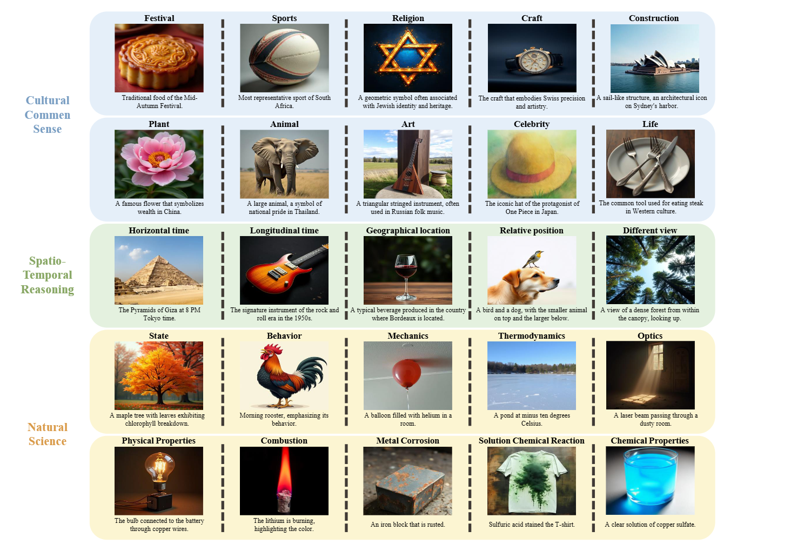

# WISE


This repository is the official implementation of [WISE]([[https://arxiv.org/abs](https://arxiv.org/abs/2503.07265)]((https://arxiv.org/abs/2503.07265))).   

## 💡 News 
- 2025/5/24: We have collected some feedback and updated our code. If you have any questions or comments, feel free to email us at [niuyuwei04@gmail.com](mailto:niuyuwei04@gmail.com)!
- 2025/3/11: We release our paper at [https://arxiv.org/abs/wise](https://arxiv.org/abs/2503.07265).
- 2025/3/10: We have released the codes and data.
  
## 🎩Introduction

Text-to-Image (T2I) models are capable of generating high-quality artistic creations and visual content. However, existing research and evaluation standards predominantly focus on image realism and shallow text-image alignment, lacking a comprehensive assessment of complex semantic understanding and world knowledge integration in text to image generation. 
To address this challenge, we propose WISE, the first benchmark specifically designed for World Knowledge-Informed Semantic Evaluation.  WISE moves beyond simple word-pixel mapping by challenging models with 1000 meticulously crafted prompts across 25 sub-domains in cultural common sense, spatio-temporal understanding, and natural science. 
To overcome the limitations of traditional CLIP metric, we introduce WiScore, a novel quantitative metric for assessing knowledge-image alignment. Through comprehensive testing of 20 models (10 dedicated T2I models and 10 unified multimodal models) using 1,000 structured prompts spanning 25 subdomains, our findings reveal significant limitations in their ability to effectively integrate and apply world knowledge during image generation, highlighting critical pathways for enhancing knowledge incorporation and application in next-generation T2I models.


## 📖WISE Eval


1.  **Prompt Generation:**  We meticulously crafted 1000 prompts across 25 sub-domains within Cultural Common Sense, Spatio-temporal Reasoning, and Natural Science.  
2.  **Image Generation:** Each prompt was fed to 20 different Text-to-Image (T2I) models (10 dedicated T2I models and 10 unified multimodal models) to generate corresponding images.  
3.  **GPT-4o Evaluation:** For each generated image, we employed **GPT-4o-2024-05-13** (with specified instructions detailed in the paper) to independently assess and score each aspect (Consistency, Realism, and Aesthetic Quality) on a scale from 0 to 2.  GPT-4o acts as a judge, providing objective and consistent scoring.
4.  **WiScore Calculation:**  Finally, we calculated the WiScore for each image based on the GPT-4o scores and the defined weights, providing a comprehensive assessment of the model's ability to generate world knowledge-informed images.


WiScore assesses Text-to-Image models using three key components:

*   **Consistency:** How accurately the image matches the prompt's content and relationships.
*   **Realism:** How believable and photorealistic the image appears.
*   **Aesthetic Quality:** How visually appealing and artistically well-composed the image is.

**WiScore Calculation:**

`WiScore = (0.7 * Consistency + 0.2 * Realism + 0.1 * Aesthetic Quality) /2`  

The **Overall WiScore** is a weighted sum of six categories:  

`Overall WiScore = (0.4 * Cultural + 0.167 * Time + 0.133 * Space + 0.1 * Biology + 0.1 * Physics + 0.1 * Chemistry)`

## Usage Guide

Evaluate using **GPT-4o-2024-05-13**:

`bash WISE/eval.sh`

Calculate the individual scores:

`python WISE/wise_culture.py scores_results.jsonl`

`python WISE/wise_space-time.py scores_results.jsonl`

`python WISE/wise_science.py scores_results.jsonl`

## 🏆 Leaderboard

**Normalized WiScore of different models**
<!DOCTYPE html>
<html lang="en">
<head>
    <meta charset="UTF-8">
    <meta name="viewport" content="width=device-width, initial-scale=1.0">


<table>
    <thead>
        <tr>
            <th colspan="8" class="lightyellow">Dedicated T2I</th>
        </tr>
        <tr>
            <th>Model</th>
            <th>Cultural</th>
            <th>Time</th>
            <th>Space</th>
            <th>Biology</th>
            <th>Physics</th>
            <th>Chemistry</th>
            <th><strong>Overall</strong></th>
        </tr>
    </thead>
    <tbody>
        <tr>
            <td>FLUX.1-dev</td>
            <td>0.48</td>
            <td><strong>0.58</strong></td>
            <td><strong>0.62</strong></td>
            <td>0.42</td>
            <td>0.51</td>
            <td><strong>0.35</strong></td>
            <td><strong>0.50</strong></td>
        </tr>
        <tr>
            <td>FLUX.1-schnell</td>
            <td>0.39</td>
            <td>0.44</td>
            <td>0.50</td>
            <td>0.31</td>
            <td>0.44</td>
            <td>0.26</td>
            <td>0.40</td>
        </tr>
        <tr>
            <td>PixArt-Alpha</td>
            <td>0.45</td>
            <td>0.50</td>
            <td>0.48</td>
            <td><strong>0.49</strong></td>
            <td><strong>0.56</strong></td>
            <td>0.34</td>
            <td>0.47</td>
        </tr>
        <tr>
            <td>playground-v2.5</td>
            <td><strong>0.49</strong></td>
            <td>0.58</td>
            <td>0.55</td>
            <td>0.43</td>
            <td>0.48</td>
            <td>0.33</td>
            <td>0.49</td>
        </tr>
        <tr>
            <td>SD-v1-5</td>
            <td>0.34</td>
            <td>0.35</td>
            <td>0.32</td>
            <td>0.28</td>
            <td>0.29</td>
            <td>0.21</td>
            <td>0.32</td>
        </tr>
        <tr>
            <td>SD-2-1</td>
            <td>0.30</td>
            <td>0.38</td>
            <td>0.35</td>
            <td>0.33</td>
            <td>0.34</td>
            <td>0.21</td>
            <td>0.32</td>
        </tr>
        <tr>
            <td>SD-XL-base-0.9</td>
            <td>0.43</td>
            <td>0.48</td>
            <td>0.47</td>
            <td>0.44</td>
            <td>0.45</td>
            <td>0.27</td>
            <td>0.43</td>
        </tr>
        <tr>
            <td>SD-3-medium</td>
            <td>0.42</td>
            <td>0.44</td>
            <td>0.48</td>
            <td>0.39</td>
            <td>0.47</td>
            <td>0.29</td>
            <td>0.42</td>
        </tr>
        <tr>
            <td>SD-3.5-medium</td>
            <td>0.43</td>
            <td>0.50</td>
            <td>0.52</td>
            <td>0.41</td>
            <td>0.53</td>
            <td>0.33</td>
            <td>0.45</td>
        </tr>
        <tr>
            <td>SD-3.5-large</td>
            <td>0.44</td>
            <td>0.50</td>
            <td>0.58</td>
            <td>0.44</td>
            <td>0.52</td>
            <td>0.31</td>
            <td>0.46</td>
        </tr>
    </tbody>
    <thead>
        <tr>
            <th colspan="8" class="softblue">Unify MLLM</th>
        </tr>
        <tr>
            <th>Model</th>
            <th>Cultural</th>
            <th>Time</th>
            <th>Space</th>
            <th>Biology</th>
            <th>Physics</th>
            <th>Chemistry</th>
            <th><strong>Overall</strong></th>
        </tr>
    </thead>
    <tbody>
          <tr>
            <td>Liquid</td>
            <td><strong>0.38</strong></td>
            <td>0.42</td>
            <td><strong>0.53<strong></td>
            <td>0.36</td>
            <td><strong>0.47<strong></td>
            <td><strong>0.30<strong></td>
            <td><strong>0.41</strong></td>
        </tr>
        <tr>
            <td>Emu3</td>
            <td>0.34</td>
            <td>0.45</td>
            <td>0.48</td>
            <td><strong>0.41</strong></td>
            <td>0.45</td>
            <td>0.27</td>
            <td>0.39</td>
        </tr>
        <tr>
            <td>Harmon-1.5B</td>
            <td>0.38</td>
            <td><strong>0.48</strong></td>
            <td>0.52</td>
            <td>0.37</td>
            <td>0.44</td>
            <td>0.29</td>
            <td></strong>0.41</strong></td>
        </tr> 
        <tr>
            <td>Janus-1.3B</td>
            <td>0.16</td>
            <td>0.26</td>
            <td>0.35</td>
            <td>0.28</td>
            <td>0.30</td>
            <td>0.14</td>
            <td>0.23</td>
        </tr>
        <tr>
            <td>JanusFlow-1.3B</td>
            <td>0.13</td>
            <td>0.26</td>
            <td>0.28</td>
            <td>0.20</td>
            <td>0.19</td>
            <td>0.11</td>
            <td>0.18</td>
        </tr>
        <tr>
            <td>Janus-Pro-1B</td>
            <td>0.20</td>
            <td>0.28</td>
            <td>0.45</td>
            <td>0.24</td>
            <td>0.32</td>
            <td>0.16</td>
            <td>0.26</td>
        </tr>
        <tr>
            <td>Janus-Pro-7B</td>
            <td>0.30</td>
            <td>0.37</td>
            <td>0.49</td>
            <td>0.36</td>
            <td>0.42</td>
            <td>0.26</td>
            <td>0.35</td>
        </tr>
        <tr>
            <td>Orthus-7B-base</td>
            <td>0.07</td>
            <td>0.10</td>
            <td>0.12</td>
            <td>0.15</td>
            <td>0.15</td>
            <td>0.10</td>
            <td>0.10</td>
        </tr>
        <tr>
            <td>Orthus-7B-instruct</td>
            <td>0.23</td>
            <td>0.31</td>
            <td>0.38</td>
            <td>0.28</td>
            <td>0.31</td>
            <td>0.20</td>
            <td>0.27</td>
        </tr>
        <tr>
            <td>show-o-demo</td>
            <td>0.28</td>
            <td>0.36</td>
            <td>0.40</td>
            <td>0.23</td>
            <td>0.33</td>
            <td>0.22</td>
            <td>0.30</td>
        </tr>
        <tr>
            <td>show-o-demo-512</td>
            <td>0.28</td>
            <td>0.40</td>
            <td>0.48</td>
            <td>0.30</td>
            <td>0.46</td>
            <td><strong>0.30</strong></td>
            <td>0.35</td>
        </tr>
        <tr>
            <td>vila-u-7b-256</td>
            <td>0.26</td>
            <td>0.33</td>
            <td>0.37</td>
            <td>0.35</td>
            <td>0.39</td>
            <td>0.23</td>
            <td>0.31</td>
        </tr>
    </tbody>
</table>

</body>
</html>

## Citation
```
@article{niu2025wise,
  title={WISE: A World Knowledge-Informed Semantic Evaluation for Text-to-Image Generation},
  author={Niu, Yuwei and Ning, Munan and Zheng, Mengren and Lin, Bin and Jin, Peng and Liao, Jiaqi and Ning, Kunpeng and Zhu, Bin and Yuan, Li},
  journal={arXiv preprint arXiv:2503.07265},
  year={2025}
}
```


## 📧 Contact
If you have any questions, feel free to contact Yuwei Niu with niuyuwei04@gmail.com

## Recommendation

If you're interested in the Unify model, [Purshow/Awesome-Unified-Multimodal](https://github.com/Purshow/Awesome-Unified-Multimodal) is one of the most comprehensive resources for papers, code, and other materials related to unified multimodal models.

